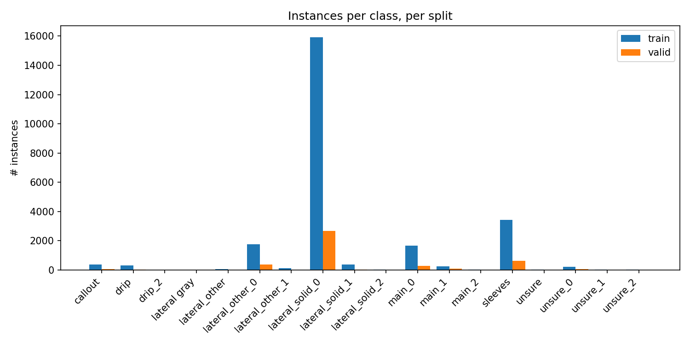
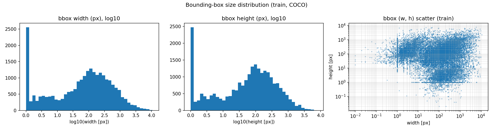
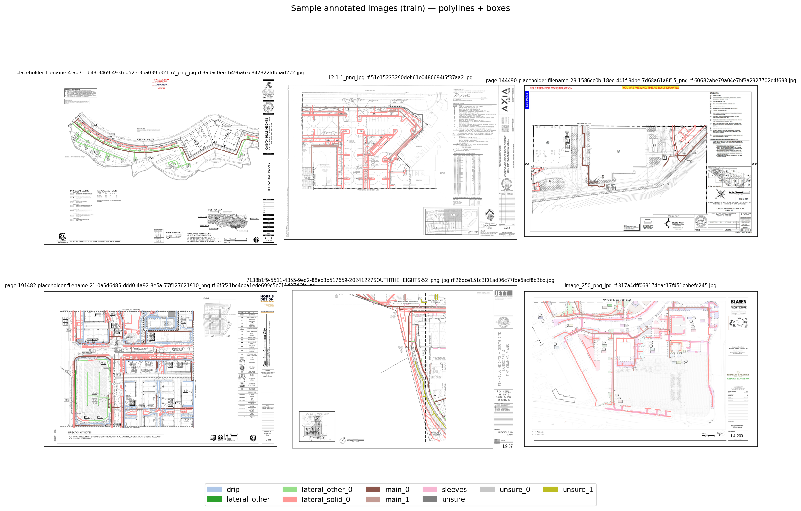

# Dataset report — `poly-irrigation.v6-v2_w_boboflow.coco`

- Dataset root (local): `/Users/james.peng/Desktop/Irrigation/datasets/poly-irrigation.v6-v2_w_boboflow.coco`
- Detected format: **COCO**
- Number of (real) classes: **18**

## Class names

- `0` — callout
- `1` — drip
- `2` — drip_2
- `3` — lateral gray
- `4` — lateral_other
- `5` — lateral_other_0
- `6` — lateral_other_1
- `7` — lateral_solid_0
- `8` — lateral_solid_1
- `9` — lateral_solid_2
- `10` — main_0
- `11` — main_1
- `12` — main_2
- `13` — sleeves
- `14` — unsure
- `15` — unsure_0
- `16` — unsure_1
- `17` — unsure_2

## Split summary

| split | images | annotations | annotated images | mean / max instances per annotated image |
| --- | ---: | ---: | ---: | --- |
| train | 190 | 24558 | 188 | 130.63 / 738 |
| valid | 33 | 4276 | 33 | 129.58 / 610 |

## Image dimensions

- **train** (190 images): W ∈ [5525, 14400], H ∈ [3575, 10800]
- **valid** (33 images): W ∈ [6800, 13650], H ∈ [4400, 9750]

## Annotation geometry (COCO)

| split | polyline | polygon | bbox-only | other |
| --- | ---: | ---: | ---: | ---: |
| train | 24553 | 4 | 1 | 0 |
| valid | 4276 | 0 | 0 | 0 |

## Annotation size statistics (train)

- Polyline length (px): n=24,553, min=1.3, p50=204.1, mean=496.5, p95=1880.4, max=21953.2
- BBox width (px):  n=24,558, min=0.0, p50=88.0, mean=308.1, p95=1304.1, max=10759.9
- BBox height (px): n=24,558, min=0.0, p50=75.8, mean=228.7, p95=970.0, max=7820.2
- BBox area (fraction of image): n=24,558, min=0.00000, p50=0.00003, mean=0.00210, p95=0.00661, max=0.66495

## Per-class instance counts

| class | train | valid | test | total |
| --- | ---: | ---: | ---: | ---: |
| callout | 381 | 76 | 0 | 457 |
| drip | 303 | 19 | 0 | 322 |
| drip_2 | 1 | 0 | 0 | 1 |
| lateral gray | 2 | 0 | 0 | 2 |
| lateral_other | 47 | 0 | 0 | 47 |
| lateral_other_0 | 1762 | 387 | 0 | 2149 |
| lateral_other_1 | 113 | 0 | 0 | 113 |
| lateral_solid_0 | 15911 | 2676 | 0 | 18587 |
| lateral_solid_1 | 378 | 43 | 0 | 421 |
| lateral_solid_2 | 28 | 0 | 0 | 28 |
| main_0 | 1656 | 295 | 0 | 1951 |
| main_1 | 252 | 92 | 0 | 344 |
| main_2 | 20 | 0 | 0 | 20 |
| sleeves | 3424 | 635 | 0 | 4059 |
| unsure | 16 | 0 | 0 | 16 |
| unsure_0 | 218 | 52 | 0 | 270 |
| unsure_1 | 22 | 1 | 0 | 23 |
| unsure_2 | 24 | 0 | 0 | 24 |

## Notes & observations

- Train annotation coverage: **188/190** images = 98.9%.
- Valid annotation coverage: **33/33** images = 100.0%.
