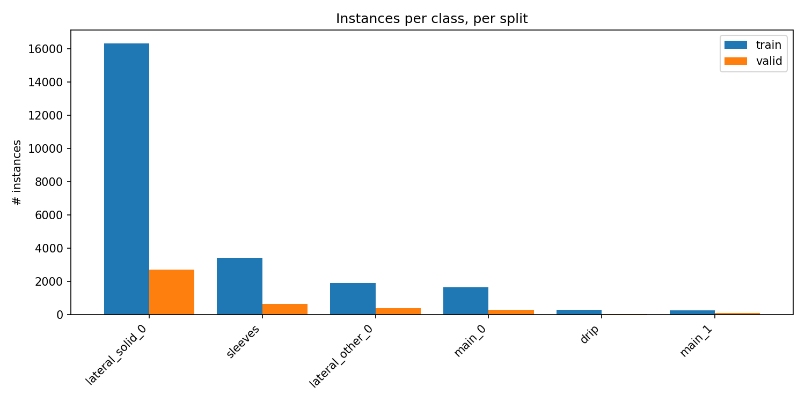
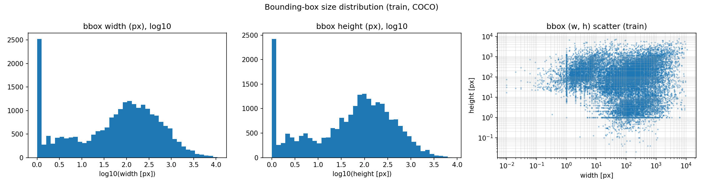
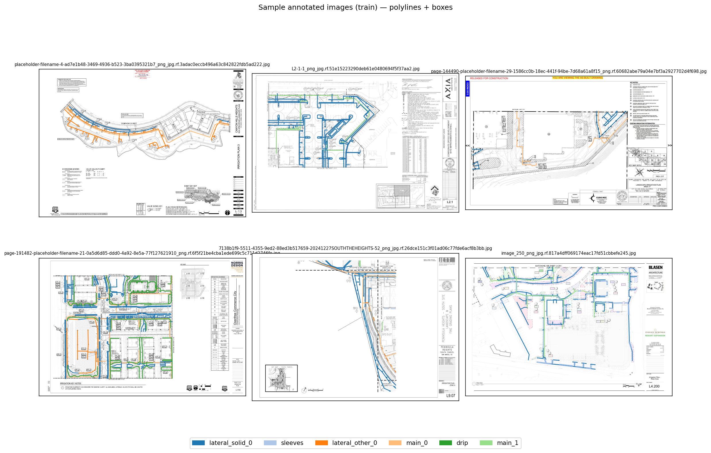

# Dataset report — `poly-irrigation.v6-v2_w_boboflow.coco.merged`

- Dataset root (local): `/Users/james.peng/Desktop/Irrigation/datasets/poly-irrigation.v6-v2_w_boboflow.coco.merged`
- Detected format: **COCO**
- Number of (real) classes: **6**

## Class names

- `0` — lateral_solid_0
- `1` — sleeves
- `2` — lateral_other_0
- `3` — main_0
- `4` — drip
- `5` — main_1

## Split summary

| split | images | annotations | annotated images | mean / max instances per annotated image |
| --- | ---: | ---: | ---: | --- |
| train | 188 | 23895 | 188 | 127.10 / 738 |
| valid | 33 | 4147 | 33 | 125.67 / 610 |

## Image dimensions

- **train** (188 images): W ∈ [5525, 14400], H ∈ [3575, 10800]
- **valid** (33 images): W ∈ [6800, 13650], H ∈ [4400, 9750]

## Annotation geometry (COCO)

| split | polyline | polygon | bbox-only | other |
| --- | ---: | ---: | ---: | ---: |
| train | 23890 | 4 | 1 | 0 |
| valid | 4147 | 0 | 0 | 0 |

## Annotation size statistics (train)

- Polyline length (px): n=23,890, min=1.4, p50=202.0, mean=490.2, p95=1848.1, max=21953.2
- BBox width (px):  n=23,895, min=0.0, p50=85.9, mean=301.9, p95=1271.0, max=10759.9
- BBox height (px): n=23,895, min=0.0, p50=74.0, mean=227.7, p95=969.0, max=7820.2
- BBox area (fraction of image): n=23,895, min=0.00000, p50=0.00003, mean=0.00196, p95=0.00640, max=0.66495

## Per-class instance counts

| class | train | valid | test | total |
| --- | ---: | ---: | ---: | ---: |
| lateral_solid_0 | 16317 | 2719 | 0 | 19036 |
| sleeves | 3424 | 635 | 0 | 4059 |
| lateral_other_0 | 1922 | 387 | 0 | 2309 |
| main_0 | 1656 | 295 | 0 | 1951 |
| drip | 304 | 19 | 0 | 323 |
| main_1 | 272 | 92 | 0 | 364 |

## Notes & observations

- Train annotation coverage: **188/188** images = 100.0%.
- Valid annotation coverage: **33/33** images = 100.0%.
